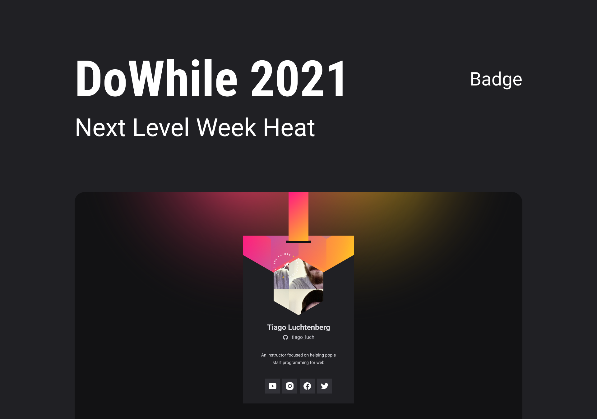

<p align="center">
  

  
  
  <a href="https://github.comlaillagaleno/badge-nlw-7/commits/main">
    
  </a>
    
   
   
   <a href="https://github.com/laillagaleno/badge-nlw-7/stargazers">
    
  </a>

  <a href="https://rocketseat.com.br">
    
  </a>
  
  <a href="https://blog.rocketseat.com.br/">
    
    </a>
</p>

<p align="center">
  
</p>

<h1 align="center">
    <a href="https://www.rocketseat.com.br/discover">🚀 NLW Heat - Mission:Origin</a>
</h1>
<p align="center">:bookmark: Crachá desenvolvido na Edição 7 da NLW - Next Level Week </p>

<h4 align="center">
    :checkered_flag: Status do Projeto: Finalizado! :heavy_check_mark:
</h4>

<p align="center">
 <a href="#-sobre-o-projeto">Sobre</a> •
 <a href="#-funcionalidades">Funcionalidades</a> •
 <a href="#-layout">Layout</a> • 
 <a href="#-como-executar-o-projeto">Como executar</a> • 
 <a href="#-tecnologias">Tecnologias</a> • 
 <a href="#-suguestões-para-o-próximo-nível">Suguestões</a> • 
 <a href="#-autor">Autora</a> • 
 <a href="#user-content--licença">Licença</a>
</p>

## 💻 Sobre o projeto
Badge - é um crachá personalizado, desenvolvido na edição 7 da NLW Heat (Mission Origin) para o evento DoWhile 2021 da Rocketseat. O projeto foi feito com tecnologias simples para a web, ideal para aqueles que estão tendo um primeiro contato com programação.

## ⚙ Funcionalidades

- [x] Acesso à API do GitHub
- [x] Linkagem de redes sociais com JS
- [x] Função de copiar e colar com JS
- [x] Notificação personalizável
- [x] Responsivo
- [x] Animações
- [x] Flip Card

## 🎨 Layout

O layout do projeto pode ser acessado no Figma:

<a href="https://www.figma.com/file/DV0qGD7fY0f7fCJ3py6VOb/%5BNLW-Heat---Mission%3A-Origin%5D-DoWhile2021-(Community)?node-id=0%3A1">
  
</a>

## 🚀 Como executar o projeto
#### Pré-requisitos

Antes de começar, você vai precisar ter instalado em sua máquina as seguintes ferramentas: [Git](https://git-scm.com/) e um editor de código-fonte, de preferencia o [VSCode](https://code.visualstudio.com/).

Com o VSCode configurado, você pode instalar a extenção **[Live Serve](https://marketplace.visualstudio.com/items?itemName=ritwickdey.LiveServer)**, permitindo que você acesse a aplicação por um servidor, facilitando a visualização das alterações em tempo real

Clone o projeto e acesse a pasta do mesmo.

```bash
# Clone este repositório
$ git clone https://github.com/laillagaleno/badge-nlw-7.git

# Acesse a pasta do projeto no seu terminal/cmd
$ cd badge-nlw-7

# A aplicação pode ser aberta com plugin Live Serve ou manualmente acessando o caminho do aquivo index.html
```
## 🛠 Tecnologias

-  **[HTML](https://www.w3schools.com/html/)**
-  **[CSS](https://www.w3schools.com/css/default.asp)**
-  **[JavaScript](https://www.w3schools.com/js/default.asp)**
-  **[Jquey](https://www.w3schools.com/jquery/default.asp)**

#### Utilitários

-   Protótipo:  **[Figma](https://www.figma.com/)**  →  **[Protótipo (Badge)](https://www.figma.com/file/DV0qGD7fY0f7fCJ3py6VOb/%5BNLW-Heat---Mission%3A-Origin%5D-DoWhile2021-(Community)?node-id=0%3A1)**
-   API:  **[GitHub API](https://api.github.com/)**  →  **[API users](https://api.github.com/users/[user})**
-   Editor:  **[Visual Studio Code](https://code.visualstudio.com/)**  
-   Fontes:  **[Google Font](https://fonts.google.com/)** → **[Roboto](https://fonts.google.com/specimen/Roboto)**


## 💡 Suguestões para o próximo nível

- [ ] Criar um layout para a parte de trás do crachá
- [ ] Desenvolver layouts específicos para usuários, visitantes e usuários logados que estão visualizando um crachá de outro
- [ ] Programar um sistema de login com o GitHub
- [ ] Armazenar dos dados de cada usuário, a partir da criação de uma conta 
- [ ] Permitir a edição dos nicknames de cada rede social de forma dinâmica
- [ ] Estabelecer regras para o acesso e edição de cada Badge
- [ ] Criar um sistema de busca, para visualizar outros Badge

## 🦸 Autora

<br/>
<a href="https://github.com/laillagaleno"><b>Lailla Galeno</b></a> 
<h5>:school_satchel:<b>NÃO ENTRE EM PÂNICO!</b>:earth_americas:</h5>
<p>Sinta-se a vontade em expor suas ideias e dúvidas quanto a aplicação ❤️ <br/> 🚀 Juntos para o próximo nivel!</p>

:coffee: Entre em contato! 
 
[](https://www.instagram.com/lailla_ga/) 
[](https://www.linkedin.com/in/lailla-galeno-01001100/) 
[](mailto:laillagalenoitz@gmail.com)

## 📝 Licença

Este projeto esta sobe a licença [MIT](./LICENSE).
